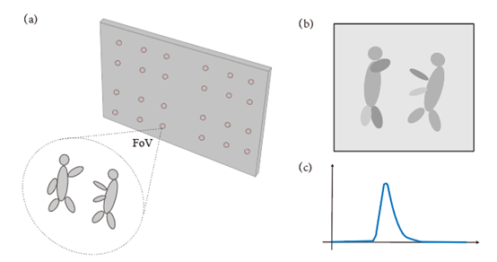
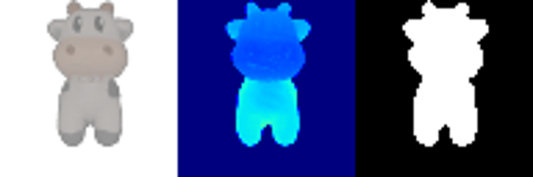
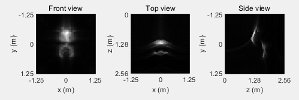
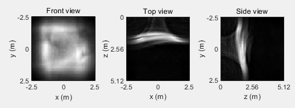
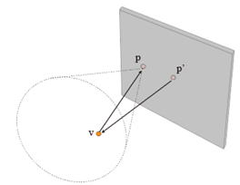

# 16-825 Assignment 4

# 0. Environment Setup

- Please follow the environment setup instructions from the previous assignment. In addition to those packages, you may need:

  - plyfile
  - scikit-image
  - [diffusers](https://huggingface.co/docs/diffusers/en/installation#install-from-source)
  - [nvdiffrast](https://nvlabs.github.io/nvdiffrast/)
  - [pymeshlab](https://github.com/cnr-isti-vclab/PyMeshLab)
  - [PyMCubes](https://github.com/pmneila/PyMCubes)
- Feel free to install other packages if required.

---

# 1. 共焦瞬态图渲染

我们要渲染瞬态图，核心是把渲染场景框定在一个球当中，这样每个扫描点都可以定义一个FoVCamera，并渲染强度图和深度图，由这两个图可以用torch的scatter_add函数生成histogram。

  

渲染瞬态图的时间取决于场景的高斯片元数目。比如sledge.ply有10万多的片元，因此一副64x64的瞬态图差不读需要1小时。而final_cow.ply有几万个片元，可以一次性放入显存，使得渲染64x64几乎只需要2-3分钟。

final_cow.ply渲染的结果保存在results/confocal_cow.mat中。真值就是在扫描中心渲染的图片，是gt_cow.png，64x64大小。运行代码 `python render_confocal.py`默认是渲染这个场景。bin宽和width设置都根据半径1.02左右确定的。per_splatting=-1，一次性全部放入显存。

  

我们用LCT求解瞬态图，可以得到不错的深度方向重建结果。但显然，奶牛的下半身重建的并不是很好，侧视图和俯视图也比较糟糕，甚至都没连续。

  

sledge.ply渲染的结果保存在results/confocal_snow.mat中。真值就是在扫描中心渲染的图片，是gt_snow.png，64x64大小。运行代码 `python render_confocal.py --data_path "./data/sledge.ply" --width 2.5 --bin_resolution 0.02 --img_dim 64 --gaussians_per_splat 2048` 。bin宽和width设置都根据半径1.3左右确定的。per_splatting因为片元太多，无法一次放入显存，只好每次放入2048个。

  

我们用LCT求解瞬态图，可以得到不错的深度方向重建结果。当然这里重建结果是反过来的。其他问题也一样，侧视图和俯视图很糟糕。

  

因此我们渲染的瞬态图是没问题的。

# 2. 非共焦瞬态图渲染

对于非共焦数据，要利用好非共焦两条边的几何关系。激光器对准p’点，面阵探测器在p位置接收回波。同样，我们以p为相机中心，渲染场景的深度图。既然有了深度，用unproject函数算出每个像素的xy坐标，结合深度就得到了v在相机坐标系的三维坐标，即知道了$\vec{pv}$。而$\vec{p_0v}=\vec{p_0p}+\vec{pv}$，其中p0和p是已知的，这样就算出了$\vec{p_0v}$。两段深度已知后，即可渲染非共焦瞬态图。

  

# 3.重建算法

We will begin our implementation of a 3D Gaussian rasterizer by first creating functionality to project 3D Gaussians in the world space to 2D Gaussians that lie on the image plane of a camera.

A 3D Gaussian is parameterized by its mean (a 3 dimensional vector) and covariance (a 3x3 matrix). Following equations (5) and (6) of the [original paper](https://repo-sam.inria.fr/fungraph/3d-gaussian-splatting/3d_gaussian_splatting_low.pdf), we can obtain a 2D Gaussian (parameterized by a 2D mean vector and 2x2 covariance matrix) that represents an approximation of the projection of a 3D Gaussian to the image plane of a camera.

For this section, you will need to complete the code in the functions `compute_cov_3D`, `compute_cov_2D` and `compute_means_2D` of the class `Gaussians`.

在 `unit_test_gaussians.py`这个单元检测代码中，不难发现，投影到二维之后是在图像空间，也就是screen space，因此这里要用camera.transform_points_screen()函数。

### 1.1.2 Evaluate 2D Gaussians

In the previous section, we had implemented code to project 3D Gaussians to obtain 2D Gaussians. Now, we will write code to evaluate the 2D Gaussian at a particular 2D pixel location.

A 2D Gaussian is represented by the following expression:

$$
f(\mathbf{x}; \boldsymbol{\mu}\_{i}, \boldsymbol{\Sigma}\_{i}) = \frac{1}{2 \pi \sqrt{ | \boldsymbol{\Sigma}\_{i} |}} \exp \left ( {-\frac{1}{2}} (\mathbf{x} - \boldsymbol{\mu}\_{i})^T \boldsymbol{\Sigma}\_{i}^{-1} (\mathbf{x} - \boldsymbol{\mu}\_{i}) \right ) = \frac{1}{2 \pi \sqrt{ | \boldsymbol{\Sigma}\_{i} |}} \exp \left ( P_{(\mathbf{x}, i)} \right )
$$

Here, $\mathbf{x}$ is a 2D vector that represents the pixel location, $\boldsymbol{\mu}$ represents is a 2D vector representing the mean of the $i$-th 2D Gaussian, and $\boldsymbol{\Sigma}$ represents the covariance of the 2D Gaussian. The exponent part $P_{(\mathbf{x}, i)}$ is referred to as **power** in the code.

$$
P_{(\mathbf{x}, i)} = {-\frac{1}{2}} (\mathbf{x} - \boldsymbol{\mu}\_{i})^T \mathbf{\Sigma}\_{i}^{-1} (\mathbf{x} - \boldsymbol{\mu}\_{i})
$$

The function `evaluate_gaussian_2D` of the class `Gaussians` is used to compute the power. In this section, you will have to complete this function.

**Unit Test**: To check if your implementation is correct so far, we have provided a unit test. Run `python unit_test_gaussians.py` to see if you pass all 4 test cases.

### 1.1.3 Filter and Sort Gaussians

Now that we have implemented functionality to project 3D Gaussians, we can start implementing the rasterizer!

Before starting the rasterization procedure, we should first sort the 3D Gaussians in increasing order by their depth value. We should also discard 3D Gaussians whose depth value is less than 0 (we only want to project 3D Gaussians that lie in front on the image plane).

Complete the functions `compute_depth_values` and `get_idxs_to_filter_and_sort` of the class `Scene` in `model.py`. You can refer to the function `render` in class `Scene` to see how these functions will be used.

### 1.1.4 Compute Alphas and Transmittance

Using these `N` ordered and filtered 2D Gaussians, we can compute their alpha and transmittance values at each pixel location in an image.

The alpha value of a 2D Gaussian $i$ at a single pixel location $\mathbf{x}$ can be calculated using:

$$
\alpha_{(\mathbf{x}, i)} = o_i \exp(P_{(\mathbf{x}, i)})
$$

Here, $o_i$ is the opacity of each Gaussian, which is a learnable parameter.

Given `N` ordered 2D Gaussians, the transmittance value of a 2D Gaussian $i$ at a single pixel location $\mathbf{x}$ can be calculated using:

$$
T_{(\mathbf{x}, i)} = \prod_{j \lt i} (1 - \alpha_{(\mathbf{x}, j)})
$$

In this section, you will need to complete the functions `compute_alphas` and `compute_transmittance` of the class `Scene` in `model.py` so that alpha and transmittance values can be computed.

> Note: In practice, when `N` is large and when the image dimensions are large, we may not be able to compute all alphas and transmittance in one shot since the intermediate values may not fit within GPU memory limits. In such a scenario, it might be beneficial to compute the alphas and transmittance in **mini-batches**. In our codebase, we provide the user the option to perform splatting `num_mini_batches` times, where we splat `K` Gaussians at a time (except at the last iteration, where we could possibly splat less than `K` Gaussians). Please refer to the functions `splat` and `render` of class `Scene` in `model.py` to see how splatting and mini-batching is performed.

### 1.1.5 Perform Splatting

Finally, using the computed alpha and transmittance values, we can blend the colour value of each 2D Gaussian to compute the colour at each pixel. The equation for computing the colour of a single pixel is (which is the same as equation (3) from the [original paper](https://repo-sam.inria.fr/fungraph/3d-gaussian-splatting/3d_gaussian_splatting_low.pdf)).

More formally, given `N` ordered 2D Gaussians, we can compute the colour value at a single pixel location $\mathbf{x}$ by:

$$
C_{\mathbf{x}} = \sum_{i = 1}^{N} c_i \alpha_{(\mathbf{x}, i)} T_{(\mathbf{x}, i)}
$$

Here, $c_i$ is the colour contribution of each Gaussian, which is a learnable parameter. Instead of using the colour contribution of each Gaussian, we can also use other attributes to compute the depth and silhouette mask at each pixel as well!

In this section, you will need to complete the function `splat` of the class `Scene` in `model.py` and return the colour, depth and silhouette (mask) maps. While the equation for colour is given in this section, you will have to think and implement similar equations for computing the depth and silhouette (mask) maps as well. You can refer to the function `render` in the same class to see how the function `splat` will be used.

这个任务是在data数据集下，给出了一个sledge.ply的三维结构，利用它生成三维高斯片元，然后对它进行渲染。

这里的核心函数是model.py中Scene对象的render函数，它首先计算每个片元的z_val并按照深度排序；然后进行高斯泼墨，即计算三维Cov、均值和二维Cov、均值，并由二维均值、Cov算出片元的权重，根据权重开始渲染透明度和透过率，完成渲染。但是片元很多的时候，需要分成一个个minibatch放入，每次渲染一部分颜色，最后求和得到最后的结果。

代码默认选择2048个Gaussian片元渲染，大约需要6GB内存。而渲染一帧的时间接近20s，因此总共要十分钟左右才能完成gif的渲染。下面是我们渲染的结果：

  

Once you have finished implementing the functions, you can open the file `render.py` and complete the rendering code in the function `create_renders` (this task is very simple, you just have to call the `render` function of the object of the class `Scene`)

After completing `render.py`, you can test the rendering code by running `python render.py`. This script will take a few minutes to render views of a scene represented by pre-trained 3D Gaussians!

Do note that while the reference we have provided is a still frame, we expect you to submit the GIF that is output by the rendering code.

**GPU Memory Usage**: This task (with default paramter settings) may use approximately 6GB GPU memory. You can decrease/increase GPU memory utilization for performance by using the `--gaussians_per_splat` argument.

> **Submission:** In your webpage, attach the **GIF** that you obtained by running `render.py`

## 1.2 Training 3D Gaussian Representations (15 points)

Now, we will use our 3D Gaussian rasterizer to train a 3D representation of a scene given posed multi-view data.

More specifically, we will train a 3D representation of a toy cow given multi-view data and a point cloud. The folder `./data/cow_dataset` contains images, poses and a point cloud of a toy cow. The point cloud is used to initialize the means of the 3D Gaussians.

In this section, for ease of implementation and because the scene is simple, we will perform training using **isotropic** Gaussians. Do recall that you had already implemented all the necessary functionality for this in the previous section! In the training code, we just simply set `isotropic` to True while initializing `Gaussians` so that we deal with isotropic Gaussians.

For all questions in this section, you will have to complete the code in `train.py`

### 1.2.1 Setting Up Parameters and Optimizer

First, we must make our 3D Gaussian parameters trainable. You can do this by setting `requires_grad` to True on all necessary parameters in the function `make_trainable` in `train.py` (you will have to implement this function).

Next, you will have to setup the optimizer. It is recommended to provide different learning rates for each type of parameter (for example, it might be preferable to use a much smaller learning rate for the means as compared to opacities or colours). You can refer to pytorch documentation on how to set different learning rates for different sets of parameters.

Your task is to complete the function `setup_optimizer` in `train.py` by passing all trainable parameters and setting appropriate learning rates. Feel free to experiment with different settings of learning rates.

### 1.2.2 Perform Forward Pass and Compute Loss

We are almost ready to start training. All that is left is to complete the function `run_training`. Here, you are required to call the relevant function to render the 3D Gaussians to predict an image rendering viewed from a given camera. Also, you are required to implement a loss function that compared the predicted image rendering to the ground truth image. Standard L1 loss should work fine for this question, but you are free to experiment with other loss functions as well.

Finally, we can now start training. You can do so by running `python train.py`. This script would save two GIFs (`q1_training_progress.gif` and `q1_training_final_renders.gif`).

For reference, here is one frame from the training progress GIF from our reference implementation. The top row displays renderings obtained from Gaussians that are being trained and the bottom row displayes the ground truth. The top row looks good in this reference because this frame is from near the end of the optimization procedure. You can expect the top row to look bad during the start of the optimization procedure.

Do note that while the reference we have provided is a still frame, we expect you to submit the GIFs output by the rendering code.

Feel free to experiment with different learning rate values and number of iterations. After training is completed, the script will save the trained gaussians and compute the PSNR and SSIM on some held out views.

使用71张多视角的Cow数据（128大小），渲染不同视角下的结果进行监督学习，优化每个Gaussian的透明度、颜色、均值和协方差（实际是scale和quats），1分钟200个epoch差不多就能看了，2分钟500个epoch就能收敛出不错的结果。训练过程的结果的变化如下：

  

下图是最后的拟合结果。最后的PSNR: 28.505，SSIM: 0.958。

  

初始时，用10000个点的点云初始化高斯面元的位置，一次性全部放入显存渲染图片，所以会更快一些。但这需要15.5GB的显存来优化。

**GPU Memory Usage**: This task (with default paramter settings) may use approximately 15.5GB GPU memory. You can decrease/increase GPU memory utilization for performance by using the `--gaussians_per_splat` argument.

> **Submission:** In your webpage, include the following details:
>
> - Learning rates that you used for each parameter. If you had experimented with multiple sets of learning rates, just mention the set that obtains the best performance in the next question.
> - Number of iterations that you trained the model for.
> - The PSNR and SSIM.
> - Both the GIFs output by `train.py`.

## 1.3 Extensions **(Choose at least one! More than one is extra credit)**

### 1.3.1 Rendering Using Spherical Harmonics (10 Points)

In the previous sections, we implemented a 3D Gaussian rasterizer that is view independent. However, scenes often contain elements whose apperance looks different when viewed from a different direction (for example, reflections on a shiny surface). To model these view dependent effects, the authors of the 3D Gaussian Splatting paper use spherical harmonics.

The 3D Gaussians trained using the original codebase often come with learnt spherical harmonics components as well. Infact, for the scene used in section 1.1, we do have access to the spherical harmonic components! For simplicity, we had extracted only the view independent part of the spherical harmonics (the 0th order coefficients) and returned that as colour. As a result, the renderings we obtained in the previous section can only represent view independent information, and might also have lesser visual quality.

In this section, we will explore rendering 3D Gaussians with associated spherical harmonic components. We will add support for spherical harmonics such that we can run inference on 3D Gaussians that are already pre-trained using the original repository (we will **not** focus on training spherical harmonic coefficients).

In this section, you will complete code in `model.py` and `data_utils.py` to enable the utilization of spherical harmonics. You will also have to modify parts of `model.py`. Please lookout for the tag `[Q 1.3.1]` in the code to find parts of the code that need to be modified and/or completed.

In particular, the function `colours_from_spherical_harmonics` requires you to compute colour given spherical harmonic components and directions. You can refer to function `get_color` in this [implementation](https://github.com/thomasantony/splat/blob/0d856a6accd60099dd9518a51b77a7bc9fd9ff6b/notes/00_Gaussian_Projection.ipynb) and create a vectorized version of the same for your implementation.

Once you have completed the above tasks, run `render.py` (use the same command that you used for question 1.1.5). This script will take a few minutes to render views of a scene represented by pre-trained 3D Gaussians.

所谓球谐函数，实际上是球面上的一组基，可以类比于FFT从时域变换到频域，球谐系数也是用一组基表示(θ,φ)在球面上的分布，0阶球谐是直流分量，各个方向分布相同；1阶球谐偏向于表示xyz三轴方向的分布。2阶球谐分量偏向展示xy，yz,xz这些45°方向的分布。通过不断增加的球谐分量，对角度分布的拟合越来越准（如下图右所示）。

   

一般来说，Nerf，3DGS中都是使用2-3阶的球谐函数。3DGS默认3阶，因此data_util.py中的colours_from_spherical_harmonics函数，输入的球谐分量是[N,48]，因为0-3阶一共有16乘3个分量。更多关于球谐分量的说明参见[链接](https://blog.csdn.net/leviopku/article/details/135136978)。

引入了球谐分量的渲染结果在q1_render_view_depend文件夹中，其实我没有看出太大区别。这可能是因为滑雪这个场景并没有明显的不同角度有不同光影的问题。

  

> **Submission:** In your webpage, include the following details:
>
> - Attach the GIF you obtained using `render.py` for questions 1.3.1 (this question) and 1.1.5 (older question).
> - Attach 2 or 3 side by side RGB image comparisons of the renderings obtained from both the cases. The images that are being compared should correspond to the same view/frame.
> - For each of the side by side comparisons that are attached, provide some explanation of differences (if any) that you notice.

### 1.3.2 Training On a Harder Scene (10 Points)

In section 1.2, we explored training 3D Gaussians to represent a scene. However, that scene is relatively simple. Furthermore, the Gaussians benefitted from being initialized using many high-quality noise free points (which we had already setup for you). Hence, we were able to get reasonably good performance by just using isotropic Gaussians and by adjusting the learning rate.

However, real scenes are much more complex. For instance, the scene may comprise of thin structures that might be hard to model using isotropic Gaussians. Furthermore, the points that are used to initialize the means of the 3D Gaussians might be noisy (since the points themselves might be estimated using algorithms that might produce noisy/incorrect predictions).

In this section, we will try training 3D Gaussians on harder data and initialization conditions. For this task, we will start with randomly initialized points for the 3D Gaussian means (which makes convergence hard). Also, we will use a scene that is more challenging than the toy cow data that you used for question 1.2. We will use the materials dataset from the NeRF synthetic dataset. While this dataset does not have thin structures, it has many objects in one scene. This makes convergence challenging due to the type of random intialization we do internally (we sample points from a single sphere centered at the origin). You can download the materials dataset from [here](https://drive.google.com/file/d/1v_0w1bx6m-SMZdqu3IFO71FEsu-VJJyb/view?usp=sharing). Unzip the materials dataset into the `./Q1/data` directory.

You will have to complete the code in `train_harder_scene.py` for this question. You can start this question by reusing your solutions from question 1.2. But you may quickly realize that this may not give good results. Your task is to experiment with techniques to improve performance as much as possible.

Here are a few possible ideas to try and improve performance:

- You can start by experimenting with different learning rates and training for much longer duration.
- You can consider using learning rate scheduling strategies (and these can be different for each parameter).
- The original paper uses SSIM loss as well to encourage performance. You can consider using similar loss functions as well.
- The original paper uses adaptive density control to add or reduce Gaussians based on some conditions. You can experiment with a simplified variant of such schemes to improve performance.
- You can experiment with the initialization parameters in the `Gaussians` class.
- You can experiment with using anisotropic Gaussians instead of isotropic Gaussians.

> **Submission:** In your webpage, include the following details:
>
> - Follow the submission instructions for question 1.2.2 for this question as well.
> - As a baseline, use the training setup that you used for question 1.2.2 (isotropic Gaussians, learning rates, loss etc.) for this dataset (make sure `Gaussians` have `init_type="random"`). Save the training progress GIF and PSNR, SSIM metrics.
> - Compare the training progress GIFs and PSNR, SSIM metrics for both the baseline and your improved approach on this new dataset.
> - For your best performing method, explain all the modifications that you made to your approach compared to question 1.2 to improve performance.

首先，对于复杂场景，我们还是按照简单场景的代码。训练1000轮的效果依然不好，结果如下。可以看出，有非常多的噪点。这主要是因为初始的点云是随机的，而且整个场景的光照更复杂，导致各向同性的拟合效果不佳。

  

因此，我们要用一些方法提高效果。这里readme已经给了我们一些建议，比如使用椭球形的高斯，优化optimizer，使用SSIM作为损失，提高迭代次数等。通过我的尝试，我发现比较有效的是用SSIM迭代2-3000轮，而用椭球形的高斯并没有比圆形的高斯好多少。

这里需要了解什么是SSIM，Mean Structural Similarity Index Measure平均结构相似度。公式如下所示，$\mu_x,\mu_y$是每个像素周围邻域的高斯均值，$\sigma_x,\sigma_y$是像素邻域的标准差，$\sigma_{xy}$是协方差。c1,c2是两个防止为0的系数，一般是0.0001和0.0009。具体的细节参见[链接](https://zhuanlan.zhihu.com/p/622244511)。简单来说就是衡量两幅图在整体亮度、对比度、结构上的相似性，SSIM越大，说明相似度越高，因此SSIM Loss实际上是1-ssim，因为SSIM不可能超过1，理论上也不会小于0（虽然在计算中可能出现略小于0的情况）。

$$
SSIM(x,y)=\frac{(2\mu_x\mu_y+c_1)(2\sigma_{xy}+c_2)}{(\mu_x^2+\mu_y^2+c_2)(\sigma_x^2+\sigma_y^2+c_2)}
$$

其实，要解决很多floater悬浮物的问题，主要是用增删高斯，调整高斯密度才能完成。通过densify&prune，基本上可以把悬浮物快速清除。结果如下。但是优化的过程需要记录片元投影到平面的半径，也需要记录投影在图像上位置的梯度，因此显存消耗会增大，峰值可以达到18GB。在训练参数上，reset_opacity之后相当于又要重新训练，因此不要重置太多次，而是在训练流程中1-2次即可，而且后面要跟上差不多次数的density and prune，这样效果会好一些。通过设计合理的优化参数，可以在1000轮（<10分钟）优化得到很不错的结果。

  

