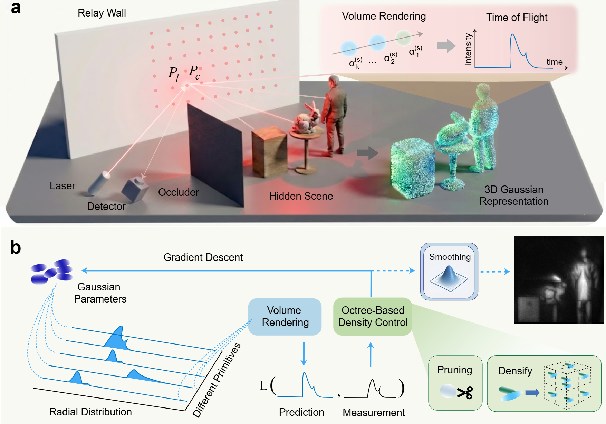
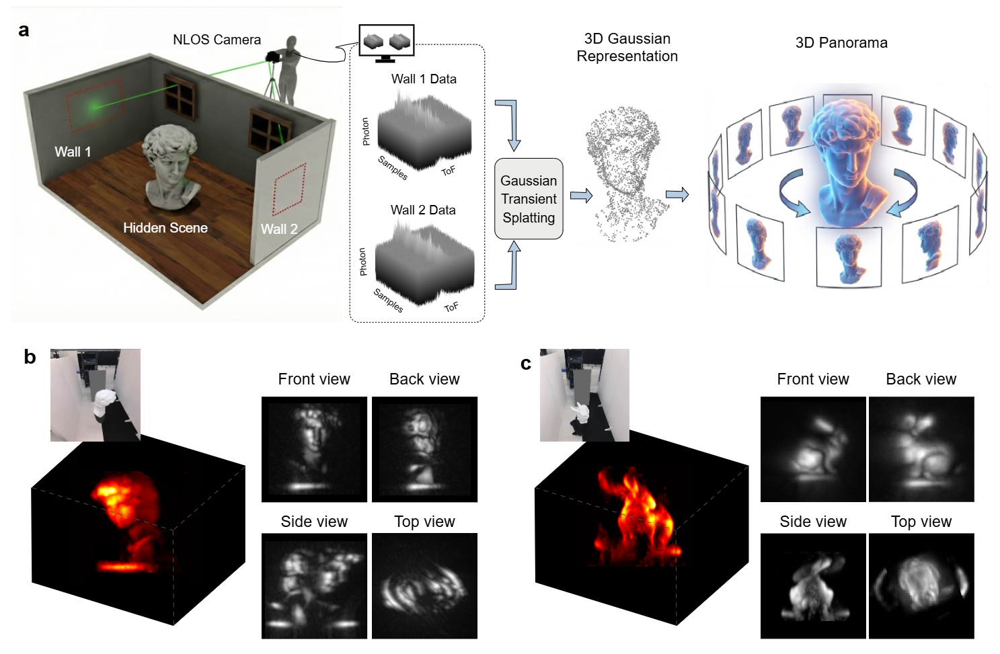
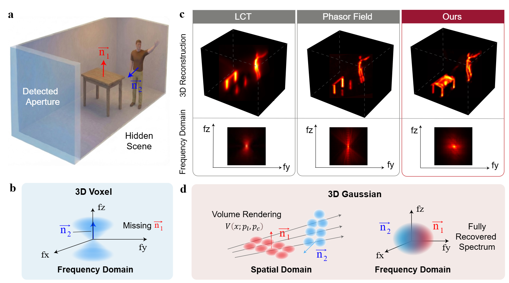

# Gaussian Transient Splatting

## 1. Installation

Create and activate the Conda environment:

```bash
conda create -n GTS python=3.12  # Note: Use python=3.10 if installing for cu118
conda activate GTS
```

Install PyTorch (Default is for CUDA 12.4):

**Bash**

```
pip install torch==2.6.0 --index-url [https://download.pytorch.org/whl/cu124](https://download.pytorch.org/whl/cu124)
# For CUDA 11.8, uncomment and use the line below instead:
# pip install [https://download.pytorch.org/whl/cu118/torch-2.6.0%2Bcu118-cp311-cp311-linux_x86_64.whl](https://download.pytorch.org/whl/cu118/torch-2.6.0%2Bcu118-cp311-cp311-linux_x86_64.whl)
```

Install required dependencies:

**Bash**

```
pip install imageio matplotlib numpy PyMCubes tqdm scipy plotly plyfile opencv-python fvcore iopath
```

Install `nvidiacub` (Required for Windows;  **not needed for Linux** ):

**Bash**

```
conda install -c bottler nvidiacub 
```

Install PyTorch3D:

**Bash**

```
pip install --extra-index-url [https://miropsota.github.io/torch_packages_builder](https://miropsota.github.io/torch_packages_builder) pytorch3d==0.7.8+pt2.6.0cu124
# For CUDA 11.8, use: pytorch3d==0.7.8+pt2.6.0cu118
```

---

## 2. Demo

#### Train Single View

Run `python train_confocal.py`. It generally converges around 5 minutes. (10GB GPU memory is necessary)

Run `python render_ply.py --data_path temp/result.ply` to visualize the results.



#### Train Multi-View for 3D Panorama

Run `python train_multi_view.py`. It generally converges in 10-20 minutes. (24GB GPU memory is necessary, more is better)

Run `python render_ply.py --data_path temp/result.ply` to visualize the results.



#### 3D Panoramic NLOS Imaging Principles

Gaussian Transient Splatting leverages volume rendering to mix spatial frequencies, thereby allowing full structural information to pass through the finite aperture. This yields a much broader recoverable spectral bandwidth compared to LCT and Phasor Field, ensuring the complete recovery of 3D shapes such as the horizontal tabletop.



---

## 3. Code Description

* **`train_confocal.py`** : Trains confocal scenes. This script does not use volume rendering but is sufficient for single-wall Non-Line-of-Sight (NLOS) scenarios.
* **Usage:** Run `python train_confocal.py`. It typically converges within 5 minutes.
* **`train_multi_view.py`** : Performs multi-view reconstruction using volume rendering.
* **Usage:** Run `python train_multi_view.py`. It generally converges in 1-2 minutes.
* **`render_ply.py`** : Renders 3D scenes represented in `.ply` format.
* **Usage:** Run `python render_ply.py --data_path temp/result.ply` to visualize the results.
* **`render_mat.m`** : MATLAB script to render 3D scenes saved in `.mat` format.
* **Usage:** Simply load `result.mat` from the output directory and execute the script in MATLAB.Util Functions
* **`gaussian.py`** : Contains the definition of Gaussian ellipsoids, the add/prune (densification) strategies, and the forward model for non-volume rendering.
* **`scene.py`** : Implementation of volume rendering for NLOS scenes.
* **`dataset.py`** : Handles data loading. A standard `.mat` file includes `data` (NLOS data), `bin_resolution`, `width` (full wall width), and `t0` (time of flight before the first histogram bin). For irregular scan points, `grid` is used to describe the sampling locations.
* **`data_utils.py`** : Contains auxiliary and helper functions.
* **`data/`** : Directory for storing datasets.
* **`results/`** : Directory containing sample result visualizations.

---

## 4. Key Improvements for Better Performance

1. **Ellipsoid Add/Prune Strategy:** Instead of using the gradient-based densification from the original Inria version, we implemented a Quadtree-based approach for adding new ellipsoids.
2. **Activation Function:** For volume rendering, changing the opacity activation function from a sigmoid to a square function significantly improved the results. When volume rendering is not used, it defaults back to sigmoid.
3. **Refined Forward Model:** Our forward model relies on the superposition of both Gaussian and Rayleigh distributions. Removing either one will result in degraded performance.
4. **Tile-based Volume Rendering:** Implementing tile-based rendering dramatically reduces GPU memory consumption without affecting the final output quality.
